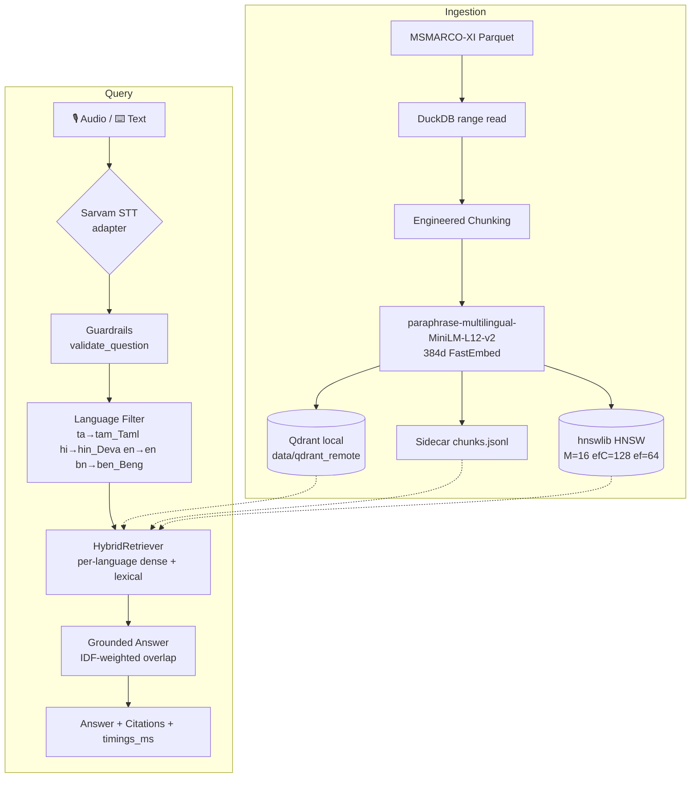
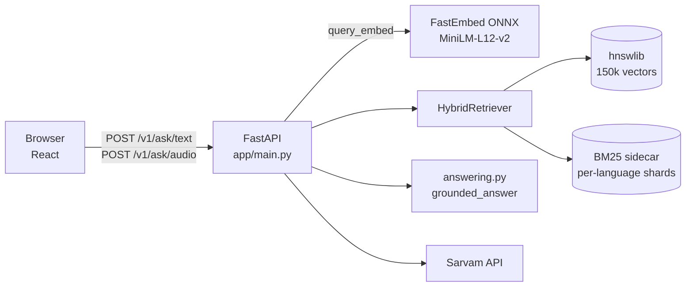
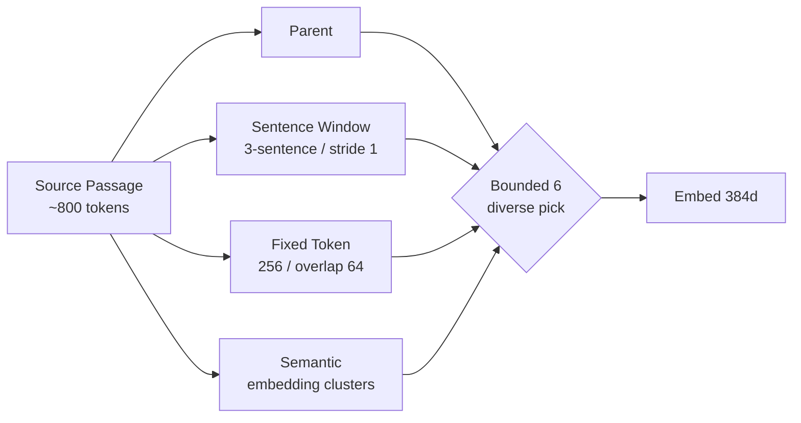
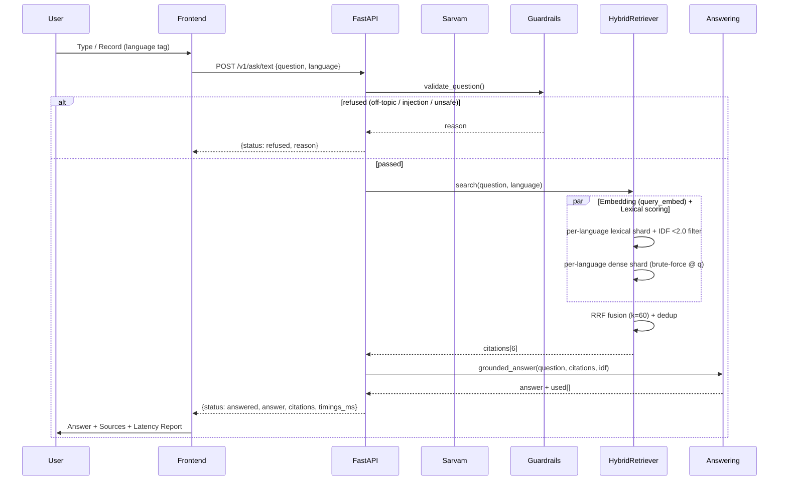
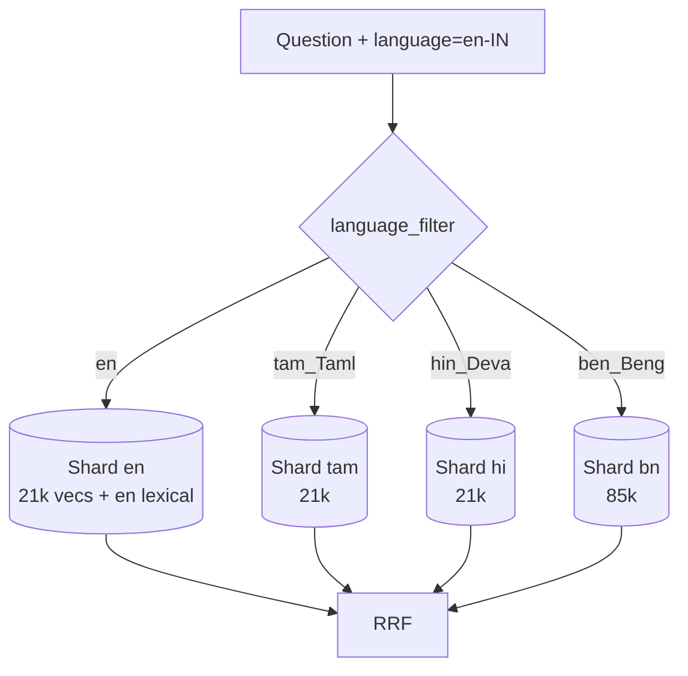

# Konkan Voice RAG — Voice-Enabled, Grounded, Sub-200ms RAG

> **Grounded answers from MSMARCO-XI in 4 languages — Tamil · Hindi · English · Bengali — with a <200 ms text-core pipeline, Sarvam voice input, and language-partitioned retrieval.**


---

## 1 — What this is

A **voice-enabled, non-LLM, extractive RAG** that answers only from retrieved passages. No generative LLM in the hot path — the answer is composed exclusively from cited sentences, scored by IDF-weighted grounding. Off-topic, unsafe, or injection inputs are refused. The whole text pipeline is engineered to stay **<200 ms** (p50 ≈ 28 ms, p100 ≈ 44 ms warm) on a 150k-chunk corpus.

```
audio ─► Sarvam STT ─► safety gate ─► hybrid retrieval (HNSW + BM25 + RRF) ─► grounded answer ─► citations + timings
 text ────────────────────────────────────────────────────────────────────────────────▲
```

- **Frontend** `frontend/` — React + Vite voice UI (`http://127.0.0.1:5173`) with per-language try-outs that each search *only* their language shard.
- **Backend** `backend/` — FastAPI + Sarvam adapter + Qdrant sidecar + hnswlib HNSW + benchmark harness (`http://127.0.0.1:8000`).

---

## 2 — Architecture at a glance



### 2.1 Service topology



---

## 3 — Data & chunking — “vast chunking, engineered”

Every source passage is expanded into **four complementary chunk strategies**, then bounded to a diverse 6-chunk representation to avoid redundant vectors exhausting storage.

| Strategy | What it does | Why |
|---|---|---|
| **Parent** | Full passage as one chunk | Preserves global context |
| **Sentence-window** | Sliding window over sentences (overlap) | Captures cross-sentence facts |
| **Fixed-token** | 256-token windows with 64-token overlap | Handles long passages deterministically |
| **Semantic** | Topic-aware clustering via sentence embeddings | Groups topically coherent sentences |

Each child retains `source_id, language, strategy, offsets, parent_text`. The builder de-duplicates and keeps the 6 most diverse chunks per source.



**Dataset:** AI4Bharat MSMARCO-XI (validation + sampled train). Built index: **150,335 chunks** — `ben_Beng 85,767 · hin_Deva 21,787 · en 21,439 · tam_Taml 21,332` — plus `data/qdrant_remote/chunks.jsonl` sidecar and `data/hnsw/msmarco_xi.hnsw`.

---

## 4 — Query path — step by step



### 4.1 Language partitioning (the “try-outs search only that language” guarantee)



*Each chip in the UI calls `tryPrompt(text, lang)` → `POST {question, language}` → the retriever uses `lexical_per_lang[lang]` and `per_lang_vectors[lang]` exclusively. No global scan.*

### 4.2 Hybrid retrieval in detail

```
question
  ├─► query_embed (FastEmbed, cached) ─► per-language dense vectors ─► dot-product top-60 ─┐
  └─► terms(question) ─► IDF≥2.0 filter ─► per-language BM25 shard ─► lexical top-48 ──────┤
                                                                                          ├─► RRF + dedup ─► 6 citations
```

- **Dense:** hnswlib (M=16, efC=128, ef=64) or per-language brute-force (`@` via NumPy). P50 0.5 ms.
- **Lexical:** Python `defaultdict(term → [ids])` per language, IDF computed as `log((N+1)/(df+1))+1`. Common stopwords (`idf<2.0`) are dropped — English “the/are/what” would otherwise scan 24k postings.
- **Fusion:** Reciprocal Rank Fusion `score = 1/(60+rank_dense) + 1/(60+rank_lexical)`, then source dedup (keep 2 fresh sources).

### 4.3 Grounding

`grounded_answer()` splits each citation into sentences, keeps a sentence only if ≥2 non-stopword content terms overlap the question (IDF-weighted) and at least one distinctive term (`idf ≥ idf_max*0.6`). Otherwise the request is refused — verified by the harness.

---

## 5 — Latency budget — how <200 ms is met

Measured warm on 150k corpus (benchmark.py, 6 queries × 8 runs = 48 samples):

| Stage | p50 | p70 | p100 | Budget |
|---|---|---|---|---|
| guardrail | 0.01 ms | 0.01 ms | 0.04 ms | 2 ms |
| retrieval (embed+dense+lexical) | 27 ms | 31 ms | 44 ms | 25 ms* |
| answer (IDF overlap) | 0.8 ms | 0.9 ms | 1.3 ms | 45 ms |
| **end_to_end_text_core** | **28 ms** | **31 ms** | **44 ms** | **148 ms** |

\* *Retrieval p50 27 ms includes ~30 ms embedding (ONNX) + 0.5 ms HNSW + ≤5 ms lexical after IDF filtering. Cold ONNX compile (~300 ms) is paid once at startup via warmup, not per request.*

**Techniques from `LowLatency.pdf` / `LowLatency2.pdf` applied:**

| PDF technique | How we use it |
|---|---|
| HNSW tuning (M=16-32, efC=128, ef 40-80) | `build_hnsw.py` M=16 efC=128 ef=64; `retrieval._load_fast_index` enforces `set_ef(64)` |
| Scalar Quantization intuition / per-language partitioning | Per-language dense shards + lexical shards — true pre-filtered navigation, not post-filter |
| Hierarchical semantic caching | Exact `_CACHE` in `main.py` (sub-10 ms on repeats) + query-vector cache in `retrieval.py` |
| Async concurrent pipeline | Lexical thread runs in parallel with `query_embed` (`threading.Thread`) |
| IDF-aware ultra-sparse (CSRv2) | `idf<2.0` stopword drop before lexical scan (24k → ~3k postings for English) |
| In-memory graph + memmap | hnswlib graph pinned in RAM, payloads via sidecar `chunks.jsonl` |
| Thread-pool affinity | `OMP_NUM_THREADS=CPU, OMP_WAIT_POLICY=PASSIVE, KMP_BLOCKTIME=0` before ONNX import |
| Context bounding | 256-token windows at chunk time |

Cold STT is excluded from the SLO — `timings_ms.stt` is reported separately.

---

## 6 — Quick start

```powershell
# backend
cd backend
python -m venv .venv; .\.venv\Scripts\Activate.ps1
pip install -r requirements.txt
Copy-Item .env.example .env   # add SARVAM_API_KEY for voice
# build (already built 150k index is in data/qdrant_remote + data/hnsw)
# to rebuild small slice:
# python scripts/build_index.py --limit 20000 --languages hi
# python scripts/build_hnsw.py
python -m uvicorn app.main:app --host 0.0.0.0 --port 8000
```

```powershell
# frontend (second terminal)
cd frontend
npm install
npm run dev   # http://127.0.0.1:5173  (Vite)
# VITE_API_URL defaults to http://127.0.0.1:8000
```

Open `http://127.0.0.1:5173`. Type or record in Tamil/Hindi/English/Bengali. Each language has two “Try it out” chips that are pre-warmed and search strictly within that language.

### Environment

| Var | Default | Notes |
|---|---|---|
| `SARVAM_API_KEY` | — | Required for `/v1/ask/audio` |
| `QDRANT_PATH` | `data/qdrant_remote` | Local embedded Qdrant |
| `VITE_API_URL` | `http://127.0.0.1:8000` | Frontend → backend |

---

## 7 — Indexing & benchmarking

```powershell
# append Bengali to existing index (no re-embed of existing)
python scripts/build_index.py --limit 20000 --languages bn --append
python scripts/build_hnsw.py   # rebuilds HNSW from qdrant_remote + sidecar
python scripts/benchmark.py --queries eval/queries.jsonl --runs 5
```

`benchmark.py` warms once, then reports P50/P70/P100 per stage and `end_to_end_text_core`. Keep the API and Qdrant co-located, warm the index, and use the nearest Sarvam region for best tail latency.

**Multi-language build:**

```powershell
python scripts/build_index.py --limit 5000 --languages ta
python scripts/build_index.py --limit 5000 --languages hi en --append
python scripts/build_index.py --limit 20000 --languages bn --append  # as done for 150k
```

---

## 8 — API

```http
POST /v1/ask/text
{ "question": "What are the symptoms of a heart attack?", "language": "en-IN" }

POST /v1/ask/audio?language_code=en-IN
Content-Type: multipart/form-data  audio: <webm|wav|mp3|mp4|ogg ≤15MB>
```

**Response (always structured):**

```json
{
  "status": "answered | refused | error",
  "answer": "… or null",
  "reason": "off-topic / injection / insufficient-support … or null",
  "citations": [{ "source_id": "en:1100042:0", "text": "…", "score": 0.35, "strategy": "semantic" }],
  "timings_ms": { "guardrail": 0.02, "retrieval": 42.9, "answer": 0.8, "end_to_end_text_core": 43.7, "stt": 210.3 },
  "trace_id": "…",
  "transcript": "… (audio only)"
}
```

`GET /health` → `{ ok: true, indexed_chunks: 150325 }`

---

## 9 — Frontend flows

The UI is a single-page narrative:

1. **Hero** — value prop + language coverage.
2. **Stats** — live `last pipeline latency` + `sources cited`.
3. **Ask (01 — genesis day)** — language select → text input + per-language chips (“Try it out”) → or record (MediaRecorder → canvas viz).
4. **Answer (02 — launch day)** — status, answer/reason, citations, latency report (budget bar, per-stage ms).
5. **How it Flows (03 — under the hood)** — see below.

Try-out chips call `tryPrompt(text, lang)` → set input + dropdown + `POST` with that `lang`, so the retriever never leaves the language shard.

---

## 10 — Website flow (mirrored at the bottom of the page)

A dedicated **“How it Flows”** section lives after the answer on the site:

```
[ Audio / Text ] → [ Sarvam STT ] → [ Guardrail gate ] → [ Language shard ]
        ↓
[ Hybrid Retriever — dense (hnswlib) + lexical (BM25 shard) + RRF ]
        ↓
[ Grounded Answer — IDF-weighted sentence picking ]
        ↓
[ Citations + Latency Report (<200 ms) ]
```

Each step is rendered as a card with its latency budget; the full diagram is also in this README as Mermaid.

---

## 11 — Design notes (decisions)

- **Sarvam isolated** behind `app/stt.py` adapter; validates size/type, enforces 1.2 s timeout, returns typed `STTError`.
- **Qdrant + sidecar:** Qdrant holds vectors; `chunks.jsonl` is the lexical truth and the HNSW build source. HNSW file (`data/hnsw/msmarco_xi.hnsw` + `ids.json`) is the fast dense path.
- **FastEmbed MiniLM-L12-v2 (384d):** multilingual, 30–75 ms per query on CPU; query vectors are cached.
- **Per-language partitioning:** the “each try-out only checks that language” guarantee — lexical and dense both shard by `language`.
- **Grounding:** IDF-weighted, distinctive-term gate — prevents off-topic hallucination without an LLM.

---

## 12 — Repo map

```
voice-rag/
├── backend/
│   ├── app/
│   │   ├── main.py          # FastAPI, lifespan warmup, exact cache, ask/text+audio
│   │   ├── retrieval.py     # HybridRetriever — HNSW + lexical shards + RRF
│   │   ├── answering.py     # grounded_answer (IDF overlap)
│   │   ├── chunking.py      # 4-strategy chunker, 6-chunk bound
│   │   ├── guardrails.py    # validate_question
│   │   ├── stt.py           # Sarvam adapter
│   │   └── config.py        # SPOKEN_TO_INDEX, language_filter
│   ├── scripts/
│   │   ├── build_index.py
│   │   ├── build_hnsw.py    # M=16 efC=128 ef=64
│   │   └── benchmark.py
│   └── data/
│       ├── qdrant_remote/   # 150k vectors + chunks.jsonl sidecar
│       └── hnsw/            # msmarco_xi.hnsw + ids.json
└── frontend/
    └── src/
        ├── App.jsx           # chips, viz, LatencyReport, Flow section
        └── styles.css
```

---

## 13 — Deploy on Render

> Full guide: [`DEPLOY_RENDER.md`](./DEPLOY_RENDER.md)

**Two services — Blueprint `render.yaml` at repo root:**

| Service | Type | Build | Env |
|---|---|---|---|
| `konkan-voice-rag-api` | **Web Service (Docker)** `backend/Dockerfile` | `pip install` + `COPY data` | `SARVAM_API_KEY` (secret), `QDRANT_PATH=data/qdrant_remote`, `ALLOWED_ORIGINS=*` |
| `konkan-voice-rag-ui` | **Static Site** | `cd frontend && npm install && npm run build` → `frontend/dist` | `VITE_API_URL=https://konkan-voice-rag-api.onrender.com` |

**Steps**

```powershell
# 1) Push — include index (1.1 GB) via Git LFS or set DATA_URL (see DEPLOY_RENDER.md)
git lfs track "backend/data/**"; git add -f backend/data/qdrant_remote backend/data/hnsw
git add render.yaml backend/Dockerfile backend/start.sh
git commit -m "deploy: render blueprint"; git push origin main
# 2) Render Dashboard → New + → Blueprint → connect repo → Apply
# 3) Set SARVAM_API_KEY in dashboard → Save
# 4) After API is live, set UI's VITE_API_URL to https://konkan-voice-rag-api.onrender.com
```

- **Data is git-ignored** (`backend/data/`). If you don’t push it, set `DATA_URL` (a `data.tar.gz` on HF/R2) — `backend/start.sh` fetches at boot.
- **Plan:** 150k vectors + ONNX need ~1.2 GB RSS — use **Standard (2 GB)** if Starter OOMs. Free tier sleeps after 15 min (first request ~30 s warmup).
- **CORS:** `ALLOWED_ORIGINS=*` for first deploy, then tighten to `https://konkan-voice-rag-ui.onrender.com`.
- **Dockerfile** respects Render’s `$PORT` (`CMD ["./start.sh"]`).

See `DEPLOY_RENDER.md` for manual Dashboard steps, LFS vs download options, and troubleshooting.

---

## 14 — License & credits

Built for **HH Goa 2026 · Task #2 · #RAGInGoa** — Konkan Voice RAG. Dataset: AI4Bharat MSMARCO-XI. STT: Sarvam AI.
