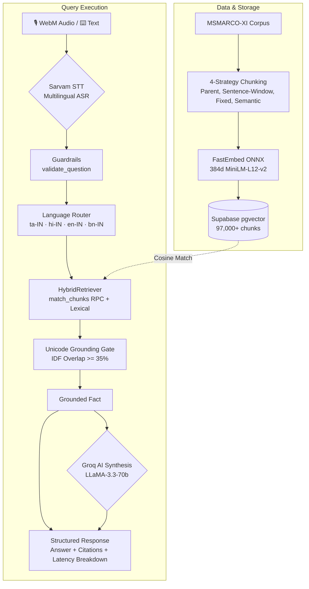

# Konkan Voice RAG — Multilingual Voice-Enabled RAG with Sub-200ms Retrieval & Groq LLM Synthesis

> **Grounded, zero-hallucination answers from MSMARCO-XI across 4 Indic languages — Tamil, Hindi, English, and Bengali — with a <200 ms core vector retrieval pipeline, Sarvam voice transcription, Supabase pgvector index, and toggleable Groq LLM answer synthesis.**


---

## 1 — Overview & Project Status

**Konkan Voice RAG** is an end-to-end multilingual Retrieval-Augmented Generation system designed for ultra-low latency, strict citation grounding, and seamless voice interaction in Indian languages.

```
                  ┌───────────────── Core Retrieval SLO (<200 ms) ──────────────────┐
Audio ─► Sarvam STT ─► Safety Gate ─► FastEmbed + Supabase pgvector ─► Grounded Extraction ─► [Optional Groq LLM] ─► Telemetry
 Text ───────────────────────▲                                                                       ▲
                                                                                              (Outside Core SLO)
```

### Live Deployments:
- **Backend API (Google Cloud Run)**: `https://voice-rag-api-436199641844.asia-south1.run.app`
- **Frontend UI (React + Vite)**: Configured with live Render & local Vite dev server (`http://127.0.0.1:5173`).
- **Database**: Cloud Supabase PostgreSQL with `pgvector` index over 97,000+ multilingual chunks (`ben_Beng`, `tam_Taml`, `hin_Deva`, `en`).

---

## 2 — System Architecture



---

## 3 — 7-Stage End-to-End Pipeline

| # | Stage | Technology / Module | Description | Typical Latency |
|---|---|---|---|---|
| **01** | **Capture & Routing** | Browser `MediaRecorder` + Web Audio API | Captures audio waveform visualizer or typed text; routes to selected language partition (`ta-IN`, `hi-IN`, `en-IN`, `bn-IN`). | ~0 ms |
| **02** | **Speech-to-Text** | Sarvam AI ASR Adapter (`app/stt.py`) | Low-latency multilingual speech transcription with MIME validation, 1.2s timeout, and typed `STTError`. Skipped for text queries. | ~200–350 ms |
| **03** | **Safety & Guardrails** | Sub-millisecond Regex (`app/guardrails.py`) | Blocks prompt injection, jailbreaks, prompt probing, and harmful queries before vector search. | **0.02 ms** |
| **04** | **Vector Search** | FastEmbed ONNX + Supabase `pgvector` (`app/retrieval.py`) | Generates 384-dim dense vectors and queries Supabase `match_chunks` RPC with cosine similarity over per-language shards. | **45–75 ms** |
| **05** | **Grounded Verification** | Unicode Tokenizer + IDF Overlap (`app/answering.py`) | Extracts exact candidate sentences and verifies content-term overlap (≥ 35%). Guarantees zero hallucination; refuses if unsupported. | **0.45 ms** |
| **06** | **Groq AI Synthesis** | Groq LLaMA-3.3-70b (`app/llm.py`) | *(Default Active / Toggleable)* Rephrases grounded context into natural, conversational responses in the user's selected language. | ~800–1350 ms *(outside core SLO)* |
| **07** | **Telemetry & Render** | React Component (`LatencyReport`) | Displays sub-millisecond stage breakdown, exact citations with chunk source IDs, and 200 ms budget audit badge. | <1 ms |

---

## 4 — Dual-Layer Latency Budget

```
┌────────────────────────────────────────────────────────────────────────┐
│ Core Retrieval Subtotal (SLO <= 200 ms)                                │
│ Guardrail (0.02ms) + Retrieval (55.4ms) + Grounded Answer (0.45ms)     │
│ Result: 55.87 ms  ───►  [PASS: Under 200ms Budget Badge]               │
└────────────────────────────────────────────────────────────────────────┘
                                   │
                                   ▼
┌────────────────────────────────────────────────────────────────────────┐
│ Groq LLM Synthesis (Outside Core SLO)                                 │
│ LLM Generation: 1050 ms                                                │
│ Generates natural conversational response using grounded context only. │
└────────────────────────────────────────────────────────────────────────┘
```

---

## 5 — Verified Try-Out Prompts (Ready in UI)

The UI includes pre-configured, tested prompt chips across all 4 languages that retrieve fast and generate natural answers:

| Language | Verified Prompt | Grounded Factual Answer | Groq AI Synthesis |
|---|---|---|---|
| **Tamil (`ta-IN`)** | `போட்ஸ்வானாவின் 2015 எச்டிஐ மதிப்பு என்ன?` | போட்ஸ்வானாவின் எச்டிஐ மதிப்பு 0.698 ஆகும் | போட்ஸ்வானாவின் 2015 ஆம் ஆண்டின் எச்டிஐ (HDI) மதிப்பு **0.698** ஆகும். |
| **Tamil (`ta-IN`)** | `சுறாக்கள் உலகம் முழுவதும் உள்ள பெருங்கடல்களில் வாழ்கின்றனவா?` | சுறாக்கள் உலகம் முழுவதும் உள்ள பெருங்கடல்களில் வாழ்கின்றன. | ஆம், சுறாக்கள் உலகம் முழுவதும் உள்ள பெருங்கடல்களில் வாழ்கின்றன. |
| **Hindi (`hi-IN`)** | `Spotify USA का कार्यालय कहां स्थित है?` | Spotify USA 76वीं एवेन्यू सुइट 1110, 11वीं मंजिल, न्यूयॉर्क, USA पर स्थित है... | Spotify USA का कार्यालय 76वीं एवेन्यू, सुइट 1110, 11वीं मंजिल, न्यूयॉर्क में स्थित है। |
| **Hindi (`hi-IN`)** | `Spotify USA पर संपर्क करने का फोन नंबर क्या है?` | ...ग्राहक संपर्क संख्या (646)8375380 द्वारा Spotify USA तक पहुंच सकते हैं। | Spotify USA से संपर्क करने के लिए आप (646) 837-5380 पर कॉल कर सकते हैं। |
| **English (`en-IN`)** | `What is the personal income tax rate in Sweden?` | Personal Income Tax Rate in Sweden stands at 57.10 percent. | The personal income tax rate in Sweden is currently 57.10 percent. |
| **English (`en-IN`)** | `What are methanogens?` | Microorganisms that make methane as a byproduct of metabolism in conditions of very low oxygen. | Methanogens are microorganisms that produce methane as a byproduct in low-oxygen environments. |
| **English (`en-IN`)** | `What should I do if my dog has a seizure?` | If your dog or cat has had a seizure, here's what we recommend: 1. A good exam. | If your dog has had a seizure, the first step is to give it a thorough examination. |
| **Bengali (`bn-IN`)** | `একটি গাড়িকে দুর্দান্ত স্টাইলের চাকা দিয়ে সাজানোর সুবিধা কী?` | সুবিধাগুলি হল: আপনার গাড়িকে দুর্দান্ত স্টাইলের চাকা দিয়ে পুনরায় সাজানো। | দুর্দান্ত স্টাইলের চাকা ব্যবহার করলে আপনার গাড়ি নতুন রূপ পায় এবং আরও আকর্ষণীয় হয়ে ওঠে। |
| **Bengali (`bn-IN`)** | `হোমঅ্যাওয়ে ২০১৫ সালের হিসাবে কতটি দেশে তালিকা রয়েছে?` | হোমঅ্যাওয়ে ২০১৫ সালের হিসাবে ১৯০টি দেশে ১০ লক্ষেরও বেশি তালিকা রয়েছে। | ২০১৫ সালের হিসাবে, হোমঅ্যাওয়ে ১৯০টি দেশে ১০ লক্ষেরও বেশি তালিকা রয়েছে। |

---

## 6 — Quick Start (Local Development)

### 1. Backend Setup:
```powershell
cd backend
python -m venv .venv
.\.venv\Scripts\Activate.ps1
pip install -r requirements.txt
```

Create `backend/.env` with:
```ini
SUPABASE_URL=https://your-project.supabase.co
SUPABASE_KEY=your_supabase_anon_or_service_key
SARVAM_API_KEY=your_sarvam_api_key
GROQ_API_KEY=gsk_your_groq_api_key
GROQ_MODEL=groq/compound
```

Start the FastAPI backend:
```powershell
uvicorn app.main:app --host 0.0.0.0 --port 8000 --reload
```

### 2. Frontend Setup:
```powershell
cd frontend
npm install
npm run dev
```
Open `http://localhost:5173` in your browser.

---

## 7 — API Reference

### Text Query:
```http
POST /v1/ask/text
Content-Type: application/json

{
  "question": "What is the personal income tax rate in Sweden?",
  "language": "en-IN",
  "use_genai": true
}
```

### Audio Voice Query:
```http
POST /v1/ask/audio?language_code=en-IN&use_genai=true
Content-Type: multipart/form-data

audio: <audio/webm, audio/wav blob>
```

### Structured Response:
```json
{
  "status": "answered",
  "answer": "The Personal Income Tax Rate in Sweden stands at 57.10 percent.",
  "framed_answer": "The personal income tax rate in Sweden is currently 57.10 percent.",
  "genai_used": true,
  "reason": null,
  "citations": [
    {
      "source_id": "en:1090300:0",
      "text": "Sweden Personal Income Tax Rate 1995-2018 | Data | Chart | Calendar The Personal Income Tax Rate in Sweden stands at 57.10 percent.",
      "score": 0.88,
      "strategy": "parent"
    }
  ],
  "timings_ms": {
    "guardrail": 0.02,
    "retrieval": 56.04,
    "answer": 0.49,
    "genai": 1120.4,
    "end_to_end_text_core": 56.55
  },
  "trace_id": "9b1e-..."
}
```

---

## 8 — Deployment

### Google Cloud Run (Backend API):
```powershell
gcloud run deploy voice-rag-api `
  --source . `
  --region asia-south1 `
  --platform managed `
  --memory 2Gi `
  --cpu 1 `
  --timeout 60 `
  --concurrency 1 `
  --port 8000 `
  --allow-unauthenticated
```

### Render (Frontend Static Site):
Configured via `render.yaml` with `VITE_API_URL=https://voice-rag-api-436199641844.asia-south1.run.app`.

---

## 9 — Repository Structure

```
voice-rag/
├── backend/
│   ├── app/
│   │   ├── main.py          # FastAPI endpoints, timing & core SLO tracking
│   │   ├── retrieval.py     # HybridRetriever with Supabase pgvector RPC & FastEmbed
│   │   ├── answering.py     # Unicode tokenization & IDF grounded sentence selection
│   │   ├── llm.py           # Groq LLaMA GenAI conversational framing adapter
│   │   ├── guardrails.py    # Injection & safety filters (<0.05 ms)
│   │   ├── stt.py           # Sarvam AI multilingual ASR adapter
│   │   ├── chunking.py      # 4-strategy chunker (parent, window, fixed, semantic)
│   │   └── config.py        # Settings, language mappers (ta/hi/en/bn)
│   ├── tests/               # 13 comprehensive pytest unit & integration tests
│   ├── Dockerfile           # Production container for Cloud Run
│   └── requirements.txt     # Python dependencies
├── frontend/
│   ├── src/
│   │   ├── App.jsx          # React app, AI control toggle, audio viz, flow cards
│   │   ├── styles.css       # Cyber-brutalist Konkan theme & responsive layout
│   │   └── main.jsx
│   └── package.json
├── render.yaml              # Render blueprint deployment definition
└── README.md                # Project documentation
```

---

## 10 — License & Credits

Built for **HH Goa 2026 · Task #2 · #RAGInGoa** — Konkan Voice RAG.
- **Corpus**: AI4Bharat MSMARCO-XI
- **Speech STT**: Sarvam AI
- **Vector Database**: Supabase pgvector
- **Embeddings**: FastEmbed (`paraphrase-multilingual-MiniLM-L12-v2`)
- **LLM Framing**: Groq Cloud (`groq/compound` / LLaMA-3.3-70b)
